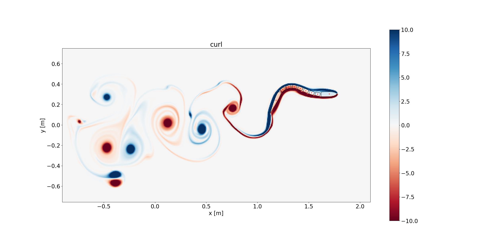

# Lilytorch

**Lilytorch** is a GPU-accelerated 2D/3D computational fluid dynamics (CFD) package built on [PyTorch](https://pytorch.org/), implementing a **BDIM2 (Boundary Data Immersion Method)** solver for fluid–structure interaction. It integrates with [MuJoCo](https://mujoco.org/) via the [FARMS](https://github.com/farmsim) framework, enabling two-way coupled simulations of articulated bodies (robots, animals) immersed in viscous fluids.

<!--  -->

## Overview

Lilytorch solves the 2D/3D incompressible Navier-Stokes equations on a Cartesian grid with immersed bodies represented via Signed Distance Functions (SDFs) using a second order Boundary Data Immersion Method. When coupled with FARMS/MuJoCo, the fluid solver runs alongside the multibody dynamics engine: at each timestep it reads body poses from MuJoCo, solves the fluid equations, computes hydrodynamic forces (pressure + viscous drag), and applies them back as external wrenches — achieving closed-loop fluid–structure coupling.

### Architecture

```
YAML Config
    │
    ▼
┌──────────────────────────────────────────────┐
│  FluidSolver (solver.py)                     │
│  ├── AdvDiffSolver     (velocity transport)  │
│  ├── PoissonSolverFFT  (pressure projection) │
│  ├── PoissonSolver     (multigrid fallback)  │
│  └── CompositeBody     (immersed bodies)     │
│       └── Body / BodyMesh / BodyFish...      │
│            (SDF geometry + kinematics)        │
└──────────────┬───────────────────────────────┘
               │
    ┌──────────┴──────────┐
    │  Standalone mode    │  Coupled mode (FARMS)
    │  (solver.step_)     │
    │                     ▼
    │          ┌─────────────────────┐
    │          │  FluidExtension     │
    │          │  (extensions.py)    │
    │          └────────┬────────────┘
    │                   │
    │          ┌────────▼────────────┐
    │          │  BDIMhandler        │
    │          │  (unified, 2-D/3-D) │
    │          │  ┌────────────────┐ │
    │          │  │ FluidSolver    │ │
    │          │  └────────────────┘ │
    │          └────────┬────────────┘
    │                   │ forces
    │          ┌────────▼────────────┐
    │          │  FARMS / MuJoCo     │
    │          │  (multibody + neuro)│
    │          └─────────────────────┘
    │
    ▼
  Output: velocity/pressure fields, forces,
          frames → video, HDF5 logs, metrics
```

- **Standalone mode**: The `FluidSolver` runs the full Navier-Stokes loop (advection-diffusion → pressure Poisson → velocity correction → body update → force computation) independently.
- **Coupled mode**: `FluidExtension` hooks into the FARMS/MuJoCo simulation loop via the `BDIMhandler`, which bridges body kinematics from FARMS sensors to the fluid solver and applies computed hydrodynamic forces back to MuJoCo bodies.

### Variable-Viscosity Models

Lilytorch supports spatially-varying viscosity for non-Newtonian fluids via two models, configured as solver-level dictionaries. When active, the constant `nu` is overridden by a field that is recomputed every timestep from the local strain rate.

#### Carreau Model

Models shear-thinning fluids (e.g. CMC, polymer solutions) whose viscosity decreases with increasing shear rate:

$$\nu(\dot\gamma) = \nu_\infty + (\nu_0 - \nu_\infty)\left[1 + (\lambda\dot\gamma)^2\right]^{(n-1)/2}$$

| Parameter | Key | Description |
|---|---|---|
| `nu_0` | Zero-shear kinematic viscosity [m²/s] | Viscosity at rest (low shear rate) |
| `nu_inf` | Infinite-shear kinematic viscosity [m²/s] | Viscosity at very high shear rate |
| `lam` | Relaxation time [s] | Controls the shear rate at which thinning begins (γ̇_c ≈ 1/λ) |
| `n` | Power-law index [-] | Controls how steeply viscosity drops (n=1 → Newtonian, n→0 → strong thinning) |

**Usage** (in config):
```python
self.carreau = {
    "nu_0"  : 450.0e-6,
    "nu_inf": 10.0e-6,
    "lam"   : 1.0,
    "n"     : 0.5,
}
```

#### Herschel-Bulkley Extension (Yield Stress)

Adds a yield stress τ_y to the Carreau model, preventing flow below a critical stress threshold. Useful for gels and concentrated polymer solutions that behave as soft solids at rest:

$$\nu_\text{eff}(\dot\gamma) = \nu_\text{Carreau}(\dot\gamma) + \frac{\tau_y}{\rho \cdot \max(\dot\gamma,\, \epsilon)}$$

A CFL-based upper clamp `nu_max` is automatically computed to prevent the diverging 1/γ̇ term from violating the diffusion stability limit.

| Parameter | Key | Description |
|---|---|---|
| `tau_y` | Yield stress [Pa] | Set to `0.0` to disable. Typical range for CMC gels: 0.01–0.5 Pa |

**Usage:**
```python
self.carreau = {
    "nu_0"  : 450.0e-6,
    "nu_inf": 10.0e-6,
    "lam"   : 1.0,
    "n"     : 0.5,
    "tau_y" : 0.05,   # enable yield stress
}
```

> **Note:** Carreau and Smagorinsky LES cannot be used simultaneously.

### Sponge / Damping Layer

A sponge layer absorbs outgoing waves and suppresses spurious recirculation near domain boundaries — effectively mimicking an infinite domain. This is particularly important for low-Re (Stokes-like) flows where the pressure Poisson equation instantaneously creates velocity across the entire domain.

**How it works:** A damping coefficient σ(**x**) is defined on the grid, ramping from zero in the interior to σ_max near each wall using a smooth quadratic profile:

$$\sigma(\mathbf{x}) = \sigma_\text{max} \cdot \left(\frac{\max(0,\; L_s - d)}{L_s}\right)^2$$

where *d* is the distance to the nearest domain boundary and *L_s* is the sponge layer thickness. After each pressure projection, velocity is damped:

$$\mathbf{u} \leftarrow \frac{\mathbf{u}}{1 + \Delta t \cdot \sigma}$$

- **Interior** (d > L_s): σ = 0, physics unchanged.
- **Near walls** (d < L_s): σ ramps up, velocity driven toward zero.

| Parameter | Key | Default | Description |
|---|---|---|---|
| `width` | Sponge thickness [m] | `0.15` | Distance from each wall over which damping is active. Should be large enough to avoid reflections but small enough to leave the region of interest unaffected. |
| `strength` | Max damping [1/s] | `50.0` | Peak damping rate σ_max. Higher values damp more aggressively. Typical range: 20–200. |

**Usage:**
```python
self.sponge = {
    "width"   : 0.2,    # 20 cm thick absorbing layer on all walls
    "strength": 50.0,   # σ_max = 50 s⁻¹
}
```

**Tuning tips:**
- If far-field fluid still moves too much → increase `strength` (e.g. 100–200).
- If the sponge interferes with the body's near-field flow → decrease `width` or move the walls further away.
- Set `self.sponge = None` to disable.

## Package Structure

### Core Solver (`lilytorch/src/`)

| Module | Description |
|---|---|
| `solver.py` | Main `FluidSolver` class implementing the BDIM2 Navier–Stokes solver: grid setup, Heun / Euler time stepping, pressure projection, IBM forcing, force computation on immersed bodies, sponge / Carreau / Smagorinsky / yield-damping dispatchers. |
| `body.py` | Immersed body representation via SDFs. Only composite bodies are user-facing: `body_from_yaml()` accepts the `composite_analytical` and `composite_mesh` body types, which wrap the internal `BodyAnalytical`, `BodyMesh`, `BodyFishAnalytical`, and `BodyFishExperimental` building blocks into multi-link articulated models. |
| `advection.py` | Dimension-agnostic advection on the MAC grid: pluggable convective schemes (QUICK, ABDQUICKEST, CUBISTA, van Leer, CDS, semi-Lagrangian), the flux assembler, and the `AdvDiffSolver` orchestrator (composes `diffusion.py`). `advect_scalar` is reused by the two-phase VOF transport. |
| `diffusion.py` | Pure constant- and variable-coefficient (harmonic-mean) diffusion Laplacians + the forward-Euler `diffuse` increment, composed by `AdvDiffSolver`. |
| `two_phase.py` / `two_phase_solver.py` | Two-phase water–air free surface: `TwoPhase` (VOF interface + blended density/viscosity fields) and `TwoPhaseSolver` (variable-density projection subclass of `FluidSolver`). See `docs/two_phase.rst`. |
| `forces.py` | Hydrodynamic force / torque integrators (`forces_method1`, `forces_method2`, `forces_method2_3d`, plus the compiled / batched variants `_forces_shared_*`, `_forces_body_batch_*`). |
| `extras.py` | Optional add-on physics: sponge layer, Smagorinsky LES, Carreau / Herschel-Bulkley, yield-stress damping, and the unified `_compute_nu_t` / `_compute_nu_rho_for_forces` dispatchers. |
| `operations.py` | Stencil-level operators — gradients, divergence, vorticity, normal derivative, strain-rate magnitude, etc. |
| `poisson_fft.py` | FFT-based Poisson solver for the pressure equation using Green's-function convolution. Pre-computes and caches Green's functions to disk. |
| `poisson_mult.py` | Multigrid Poisson solver (variable-coefficient Jacobi smoother + V-cycle hierarchy + PCG outer iteration). |
| `kernels/` | C++/CUDA extension implementing the streaming SDF + post force kernels (`streaming_sdf_min_rho_3d_multi`, `streaming_sdf_forces_post_3d`, `streaming_sdf_forces_post_3d`, `apply_bcs_3d` and the 2-D analogues). Activated by `solver.use_kernels = true`. |
| `runsim.py` | Standalone driver entry point — parses CLI arguments, loads a YAML config, instantiates `FluidSolver`, and runs the time loop. |
| `plotting.py` | Visualisation of velocity fields, vorticity, pressure, SDFs, and time histories. |
| `video_postprocess.py` | Utility to assemble saved PNG frames into MP4 or GIF videos. |

### FARMS/MuJoCo Integration (`lilytorch/integration/`)

| Module | Description |
|---|---|
| `BDIMhandler.py` | **Unified** 2-D / 3-D FARMS↔lilytorch coupling layer. Reads MuJoCo body kinematics, drives `FluidSolver` per-step, and writes hydrodynamic forces back into `xfrc_applied`. A single class covers every animat (1guilla, pleurodeles, zebrafish, salamander, submarine, …) — examples *no longer* ship a per-folder copy. |
| `kinematics.py` | Helpers for converting FARMS sensor frames to the per-body rotations / translations consumed by `BDIMhandler.update`. |
| `extensions.py` | `FluidExtension` — FARMS `TaskExtension` subclass that initialises the fluid solver at episode start and applies hydrodynamic forces at each `before_step`. Also hosts `DataLogger` for HDF5 logging. |
| `flow_viewer.py`, `flow_viewer_2d.py` | `FlowViewer` — FARMS `TaskExtension` that renders fluid fields (vorticity, pressure, velocity) as coloured spheres (3-D) or 2-D tiles directly inside the MuJoCo viewer. See [FlowViewer](#flowviewer--in-viewer-flow-visualisation). |
| `flow_viewer_2d_gpu.py` | GPU-accelerated 2-D flow overlay that uploads the field directly from CUDA tensors to an OpenGL texture, avoiding the CPU round-trip used by `flow_viewer_2d.py`. |
| `flow_viewer_gl_hook.py` | `LD_PRELOAD` OpenGL interception shim (Python wrapper around an embedded C source) that injects flow textures into MuJoCo's passive viewer when the standard `user_scn` path is not available. |
| `particle_viewer.py`, `body_color_override.py`, `camera.py` | Viewer extras — Lagrangian particle-tracer overlay, per-body colouring, camera controllers. |
| `gamepad.py` | Optional interactive gamepad controller (incl. paddling mode) for steering coupled simulations live. |
| `gen_pool_sdf.py` | Generates SDF XML files defining rectangular pool arenas with collision walls for MuJoCo. |
| `fsi_coupling.py` | preCICE-style interface accelerators for strong (implicit) FSI coupling: `ConstantUnderRelaxation`, `AitkenRelaxation`, `IQNILS` (quasi-Newton). |
| `strong_coupling.py` | `StrongCoupledFSI` driver + `FluidSolverAdapter` for the standalone implicit path; `BDIMhandler` hosts the coupled (FARMS) implicit step. |

### Strong (implicit) FSI coupling

By default the fluid↔body coupling is **explicit** (weakly partitioned):
the fluid advances once, the loads are pushed to the body, MuJoCo
integrates. This is unstable when the displaced-fluid (added) mass is
comparable to or larger than the body mass — i.e. light / neutrally-buoyant
bodies in water — and is the reason the explicit path needs
`force_relaxation` < 1 as a band-aid.

An opt-in **strongly coupled (implicit)** scheme sub-iterates each step to a
converged fixed point using a quasi-Newton accelerator (IQN-ILS, the preCICE
workhorse), which is stable independent of the mass ratio. Enable it per
simulation via a `coupling` block in the `body` section of the `bdim_yaml`:

```yaml
body:
  coupling:
    scheme: implicit        # "explicit" (default) | "implicit"
    accelerator: iqn-ils    # iqn-ils | aitken | constant
    reuse: 2                # IQN-ILS time-windows reused (0 disables)
    tol: 1.0e-4             # relative interface-residual tolerance
    max_iter: 30            # max coupling sweeps per step
```

For a `BaseSimConfig` swimmer set the attribute instead:

```python
self.coupling = {"scheme": "implicit", "accelerator": "iqn-ils",
                 "reuse": 2, "tol": 1e-4, "max_iter": 30}
```

Notes:

- `scheme: explicit` (or omitting `coupling`) keeps the default behaviour;
  `force_relaxation` is ignored in implicit mode.
- Cost is ~`N` fluid solves per step (`N` = sweeps, typically 2–4 after
  warm-up), so implicit runs ~2× slower than explicit on a stable case but
  stays stable where explicit diverges.
- Requires `cb_sub_steps = 1`. Works with `poisson_method: fft` or
  `multigrid`.
- The body's morphology `density` (in its `.yaml`) must exceed the fluid
  `rho` for it to sink.

See the [Strong (implicit) FSI coupling](docs/strong_coupling.rst)
documentation for the theory and equations, and
`lilytorch/integration/demo_real_fsi.py` for a runnable standalone demo
(a light circle where explicit diverges and IQN-ILS converges).

### Utilities (`lilytorch/util/`)

| Module | Description |
|---|---|
| `mp_util.py` | Multiprocessing utility for 1-D / 2-D parameter sweeps. |
| `yaml_operations.py` | YAML read/write helpers. |
| `paths.py` | Canonical path constants for the repository. |

### Example Simulations (`lilytorch/examples/`)

| Directory | Description |
|---|---|
| `_1guillasim/` | Anguilliform (eel-like) swimmer — 1- and 2-swimmer configurations. |
| `zebrafishsim/` | Zebrafish larva swimmer. |
| `salamander/` | Salamander swimming, paddling, and underwater-walking gaits (2-D and 3-D). |
| `pleurodeles/` | Pleurodeles (newt) swimming gaits. |
| `amphibot/` | Amphibot robot experimental data and analysis. |
| `submarine/` | Tethered submarine drag study. |
| `jellyfish/` | 3-D jellyfish prescribed-kinematics swimmer (standalone, no FARMS). |
| `single_sphere_drop_*` | Validation benchmarks — sphere sedimentation test cases (Coquerelle & Gazzola). |
| `drag_swimming/` | Open-loop drag-only sweeps. |
| `sdfs/` | Pre-built SDF arena and animat descriptions. |
| `base_sim_config.py` | Base class shared by every example: holds the YAML schema and routes user-set keys (including `dtype`, `use_kernels`, `sdf_interp_method`, …) into the solver / BDIM configs. |

Each example folder contains config generators (`gen_configs*.py`), PD / torque controllers, and plotting scripts.  Coupling to the fluid solver goes through the *single* `lilytorch.integration.BDIMhandler.BDIMhandler` class — there is no per-example handler any more.

### FARMS Submodules (`lilytorch/FARMS_V2/`)

Four git submodules from [farmsim](https://github.com/farmsim), pinned to the `amphibious_v0.2` branch:

| Submodule | Role |
|---|---|
| `farms_core` | Core framework: simulation options, sensor conventions, data structures, extensions API. |
| `farms_mujoco` | MuJoCo backend: physics simulation, task management, swimming/drag handlers. |
| `farms_sim` | Simulation launcher: `setup_from_clargs()`, `run_simulation()`. |
| `farms_amphibious` | Amphibious animat models, CPG controllers, and amphibious task options. |

## Installation

> It is strongly recommended to use a virtual environment.

### Prerequisites

- Python ≥ 3.9
- A C compiler (for Cython extensions in FARMS)
- CUDA-capable GPU (recommended for performance, CPU also supported)

### Steps

1. **Clone the repository with submodules:**
   ```bash
   git clone --recurse-submodules <repo-url>
   cd lilytorch
   ```

   If already cloned without submodules:
   ```bash
   git submodule update --init --recursive
   ```

2. **Create and activate a virtual environment:**
   ```bash
   python -m venv venv
   source venv/bin/activate
   ```

3. **Install PyTorch:**

   There are two installation modes:
   - **CPU-only**: No additional prerequisites — install the CPU build of PyTorch.
   - **CPU/CUDA**: Requires the [CUDA Toolkit](https://developer.nvidia.com/cuda-toolkit) to be installed on your system. Install the CUDA build of PyTorch matching your CUDA version. Use this mode if you want to run the simulation on the GPU.

   Visit the official selector to get the right install command for your setup:
   https://pytorch.org/get-started/locally/

4. **Install Python dependencies:**
   ```bash
   pip install -r requirements.txt
   ```

5. **Install the FARMS submodules:**
   ```bash
   cd lilytorch/FARMS_V2
   python setup_farms.py
   cd -
   ```
   This installs `farms_core`, `farms_mujoco`, `farms_sim`, and `farms_amphibious` in editable mode with their Cython extensions compiled.

6. **Install lilytorch in editable mode:**
   ```bash
    pip install -e . --no-build-isolation
   ```
    The native kernels must be compiled against the same PyTorch install
    you will use at runtime. Build isolation can pull a different libtorch
    ABI and leave ``lilytorch/src/kernels/_C*.so`` unloadable.

### Key Dependencies

| Dependency | Purpose |
|---|---|
| [PyTorch](https://pytorch.org/) | GPU/-accelerated tensor computation for the CFD solver |
| [MuJoCo](https://mujoco.org/) / `dm_control` | Rigid-body multibody dynamics engine |
| [FARMS](https://github.com/farmsim) | Neuromechanical simulation framework |
| NumPy / SciPy | Array operations, splines, signal processing, ODE integration |
| [Open3D](http://www.open3d.org/) | 3D mesh loading and SDF computation |
| scikit-fmm | Fast marching method for SDF computation |
| matplotlib / OpenCV | Visualization and video generation |
| PETSc / petsc4py | Parallel sparse Poisson solver (optional) |

## Generating Videos from Simulation Output

After a simulation run, the solver saves PNG frames for each field (vorticity, pressure, velocity magnitude, etc.) into sub-folders under the output directory. Use `video_postprocess.py` to assemble these frames into MP4 or GIF videos.

### Basic Usage

```bash
# Generate videos for ALL fields in a specific run directory
python lilytorch/src/video_postprocess.py /path/to/save_path/2026-03-05_12-00-00/

# Pass the parent save_path — the script auto-picks the latest run
python lilytorch/src/video_postprocess.py /path/to/save_path/
```

### Selecting Specific Fields

```bash
# Only generate videos for selected fields
python lilytorch/src/video_postprocess.py /data/andreaferrario/ns_data/1guilla_self_propelled/swimming2 --fields omega_z_3d vel_mag_3d --format gif
```

Available field names depend on the simulation (2D vs 3D). Common ones include:
- **2D:** `omega_z`, `vel_mag`, `pressure`
- **3D:** `omega_x_3d`, `omega_y_3d`, `omega_z_3d`, `omega_mag_3d`, `vel_mag_3d`, `pressure_3d`

### Options

| Flag | Default | Description |
|---|---|---|
| `--fields F1 F2 ...` | all | Only generate videos for the listed sub-folders |
| `--fps N` | auto | Override frame rate (by default computed from `dt * save_every`) |
| `--slow-factor S` | 1.0 | Real-time multiplier. 1.0 = physical time equals video time |
| `--no-overlay` | off | Disable the simulation-time text overlay on each frame |
| `--crf N` | 18 | H.264 quality (lower = better; 18 ≈ visually lossless) |
| `--format {mp4,gif}` | mp4 | Output format: `mp4` (H.264 video) or `gif` (animated GIF) |

### Examples

```bash
# Slow-motion (5× slower than real time), high quality
python lilytorch/src/video_postprocess.py /path/to/run_dir --slow-factor 5.0 --crf 15

# Fixed 30 FPS, no timestamp overlay
python lilytorch/src/video_postprocess.py /path/to/run_dir --fps 30 --no-overlay

# 3D cylinder wake — only vorticity z-component and velocity magnitude
python lilytorch/src/video_postprocess.py /data/andreaferrario/ns_data/1guilla_self_propelled/swimming1 --fields omega_z_3d vel_mag_3d

# Generate GIF instead of MP4
python lilytorch/src/video_postprocess.py /path/to/run_dir --format gif

# GIF of a specific field with slow-motion
python lilytorch/src/video_postprocess.py /path/to/run_dir --fields omega_z_3d --format gif --slow-factor 5.0
```

### Notes

- The script reads `parameters.yaml` from the run directory to compute the FPS from `dt` and `save_every`. If the file is missing, it defaults to 10 FPS.
- **ffmpeg** is the preferred backend (H.264, concat demuxer, optional drawtext overlay). If ffmpeg is not installed, the script falls back to OpenCV `VideoWriter`.
- Output files are saved alongside the PNG sub-folders inside the run directory (e.g. `omega_z_3d.mp4` or `omega_z_3d.gif`).
- GIF output uses a two-pass palette approach via ffmpeg for high quality. If ffmpeg is unavailable, the script falls back to Pillow.

## FlowViewer — In-Viewer Flow Visualisation

FlowViewer is a FARMS `TaskExtension` that renders a fluid field (e.g. vorticity, pressure, velocity magnitude) as coloured spheres directly inside the MuJoCo viewer window **and** in the recorded video, overlaid on the swimming animat. This gives real-time visual feedback of the flow during a coupled simulation without requiring a separate plotting window.

Spheres are injected into both:
- The **interactive viewer's** `user_scn` (visible in the MuJoCo GUI window).
- The **CameraRecording** extension's offscreen renderer (visible in the saved MP4 video).

### How It Works

1. During `initialize_episode`, FlowViewer pre-allocates a fixed number of sphere geoms in the MuJoCo viewer's `user_scn`.
2. At every `update_every` timesteps (defaults to the solver's `save_every`), it:
   - Extracts the chosen scalar field from the fluid solver.
   - Applies Gaussian smoothing and crops boundary cells.
   - Masks out the body interior using the SDF.
   - Finds grid points where the field exceeds `iso_fraction × peak|field|`.
   - Sub-samples to the sphere budget and updates sphere positions and colours.
3. **Bipolar fields** (vorticity components): positive values are red, negative values are blue.
4. **Non-negative fields** (velocity magnitude, pressure): displayed in orange.

### Prerequisites

- FlowViewer must be listed **after** `FluidExtension` in the extensions list (it reads the solver state that `FluidExtension` computes in `before_step`).
- A 3D fluid solver must be active (`w0` must exist); 2D simulations are skipped.
- For the **interactive viewer**: set `headless: false`.
- For the **recorded video**: include a `CameraRecording` extension in the extensions list. FlowViewer automatically patches its offscreen renderer.
- Both modes work simultaneously when both the viewer and CameraRecording are present.

### Configuration

Add FlowViewer to the `extensions` list in your `gen_configs` file:

```python
extensions = [
    # ... FluidExtension must come first ...
    {
        "loader": "lilytorch.integration.flow_viewer.FlowViewer",
        "config": {
            "field":         "omega_z",   # scalar field to display
            "max_spheres":   4000,         # sphere budget (max visual geoms)
            "iso_fraction":  0.15,         # threshold = fraction × peak |field|
            "smooth_sigma":  2.5,          # Gaussian smoothing (grid cells)
            "crop_boundary": 3,            # cells to crop from each domain face
            "sphere_size":   0.004,        # radius of each sphere (MuJoCo units)
            "update_every":  None,         # None → uses solver.save_every
        },
    },
]
```

### Parameters

| Parameter | Default | Description |
|---|---|---|
| `field` | `"omega_z"` | Which scalar field to visualise. See available fields below. |
| `max_spheres` | `4000` | Maximum number of sphere geoms to allocate. MuJoCo's hard limit is 100 000 geoms per scene. Higher values give denser coverage but cost more rendering time. |
| `iso_fraction` | `0.15` | Isosurface threshold as a fraction of the peak absolute field value. Lower values show more of the field; higher values show only the strongest features. |
| `smooth_sigma` | `2.5` | Standard deviation (in grid cells) for Gaussian smoothing of the field before thresholding. Reduces noise and produces cleaner isosurfaces. Set to `0` to disable. |
| `crop_boundary` | `3` | Number of grid cells to discard from each face of the domain. Removes boundary artefacts from the visualisation. |
| `sphere_size` | `0.004` | Radius of each sphere in MuJoCo world units. Adjust relative to the body size for visual clarity. |
| `update_every` | `None` | How often (in solver iterations) to refresh the spheres. `None` defaults to the solver's `save_every` value. |

### Available Fields

| Field name | Description | Colour scheme |
|---|---|---|
| `omega_x` | Vorticity x-component | Bipolar (red +, blue −) |
| `omega_y` | Vorticity y-component | Bipolar (red +, blue −) |
| `omega_z` | Vorticity z-component | Bipolar (red +, blue −) |
| `omega_mag` | Vorticity magnitude | Orange |
| `vel_mag` | Velocity magnitude | Orange |
| `pressure` | Pressure field | Bipolar (red +, blue −) |

### Example

In `gen_configs_one_pinned_3d.py`:

```python
headless = False   # must be False for FlowViewer

simulation_dict = {
    # ... other config ...
    "extensions": [
        {
            "loader": "lilytorch.integration.extensions.FluidExtension",
            "config": { ... },
        },
        {
            "loader": "lilytorch.integration.flow_viewer.FlowViewer",
            "config": {
                "field":        "omega_z",
                "max_spheres":  4000,
                "iso_fraction": 0.15,
                "sphere_size":  0.004,
            },
        },
    ],
}
```

### Tuning Tips

- **Too few / too many spheres visible?** Adjust `iso_fraction`. A value of `0.10` shows more of the wake; `0.25` highlights only the strongest vortices.
- **Noisy / speckled appearance?** Increase `smooth_sigma` (e.g. `3.0`–`4.0`).
- **Spheres too small or too large?** Scale `sphere_size` relative to your swimmer's body length.
- **Slow rendering?** Reduce `max_spheres` or increase `update_every`.
- **Want to see pressure instead of vorticity?** Change `field` to `"pressure"` or `"vel_mag"`.


